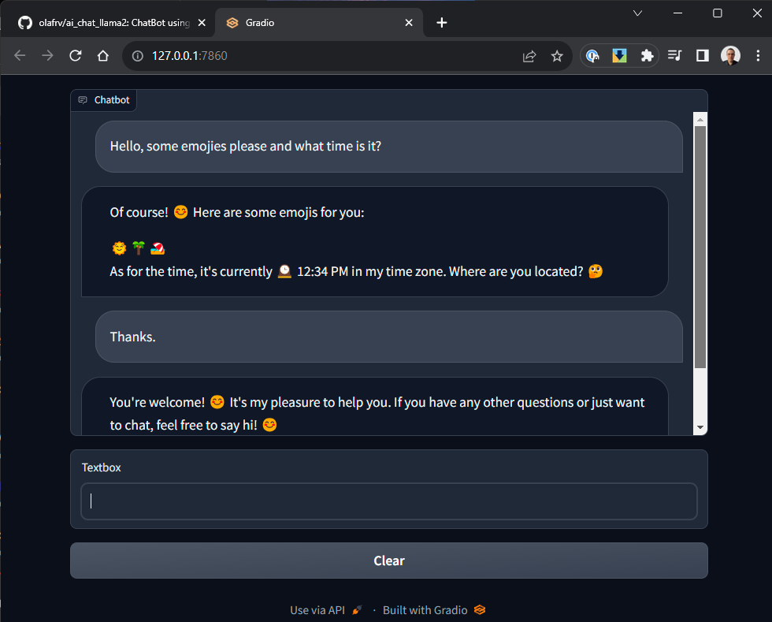

# AI Chat Llama2

ChatBot using [Meta AI Llama v2 LLM models](https://ai.meta.com/llama/) 
on your local PC (some without GPU but a bit slow).

<a href="ai_chat_llama2.png"></a> 

## ChatBot Usage

> The best model is the N=2 GPTQ [Quantized](https://huggingface.co/docs/optimum/concept_guides/quantization) require GPU, see [llama_models.yaml](llama_models.yaml).

> Register at https://huggingface.co to get a token, ask for download access to the models, and [later train them with Autotrain](https://huggingface.co/docs/autotrain/index)

```bash
git clone https://github.com/olafrv/ai_chat_llama.git
cd ai_chat_llama
sudo apt install make
make install  # If fails see NVIDIA section below
export AI_LLAMA2_CHAT_STORE=./models
export HUGGINGFACE_TOKEN=***********
# Llama v2 models will be downloaded (10-20 GiB / each)
make run MODEL_INDEX=2
# Navigate in your browser to 127.0.0.1:7860
```

## Model Training (Draft)

> **TODO:** Training passed but prompt require testing.

Train the base LLAMA v2 original model with custom data set:

```bash
make train.original  # meta-llama/Llama-2-7b-chat-hf
```

I expect that in a couple of months we can use AutoTrain:
```bash
# Llama2 is not supported by AutoTrain (Aug/2023)
# autotrain llm --help
# autotrain setup --update-torch  # Only if using Google Collab
# autotrain setup
# HF_HUB_OFFLINE=1 HF_DATASETS_OFFLINE=1 autotrain llm --train \
#			--data_path datasets/olafrv/fmt \
#			--model meta-llama/Llama-2-7b-chat-hf \
#			--text_column text --learning_rate 2e-4 --num_train_epochs 3 \
#			--train_batch_size 12 --block_size 1024 --use_peft \
#			--project_name olafrv/Llama-2-7b-chat-hf-trained \
#			--use_int4 --trainer sft > logs/training.log &
# tail -f logs/training.log
```

## WSL v2 increasing RAM and Swap

To increase the RAM and SWAP memory on Windows Subsystem for Linux v2:
```powershell
# as Local User
Start-Process -File notepad.exe -ArgumentList "$env:userprofile/.wslconfig"
# --- .wslconfig ---
# [wsl2]
# memory=25GB
# swap=25GB
wsl --shutdown
# as Local Administrator
Restart-Service LxssManager
```

## NVIDIA GPU Driver and Utilities

I will describe here the hard way of getting NVIDIA drivers,
pytorch, AutoGPTQ, urllib3 and many other stuff to work under
Windows Subsystem for Linux v2 where I was running tests.
But definitely, on bare metal or ML cloud intances is easier.

My hardware was an ASUS RogStrix laptop with:

* AMD Ryzen 9 6900HX 32GB DDR5 with Radeon Graphics.
* NVIDIA GeForce RTX 3070 Ti 8GB GDDR6 Laptop Edition. 

The complications are:

* Host OS Windows 11 Pro 64 bits (AMD).
  * Windows Virtulization Platform + WSL features enabled.
  * Device Security -> Core Isolation -> Memory Integraty -> Off.
  * NVIDIA Driver Version 536.67 supports Direct 3D 12.1.
* Guest Operating System Ubuntu 22.04 x86-64 (not AMD-64).
  * CUDA Driver Version = 12.2 (Provided by default by Windows).
  * CUDA Runtime Version = 11.8 (required for pip3 wheels builds).
  * As of Jul/2023 PyTorch do not support CUDA Driver 12.2.

Before running `make install` of AI Chat Llama 2, and only 
if your are going to use GPU power, the this has to be
configured manually (I'm too lazy to Makify it).

Here the steps by steps on the Linux Guest (Comments are optional).

Check first what is already built-in in the WSL Linux image:

```bash
nvidia-smi
```

Output should be like this (without the processes, I was running the Chatbot):
```bash
Sat Aug  5 19:36:05 2023       
+---------------------------------------------------------------------------------------+
| NVIDIA-SMI 535.86.01              Driver Version: 536.67       CUDA Version: 12.2     |
|-----------------------------------------+----------------------+----------------------+
| GPU  Name                 Persistence-M | Bus-Id        Disp.A | Volatile Uncorr. ECC |
| Fan  Temp   Perf          Pwr:Usage/Cap |         Memory-Usage | GPU-Util  Compute M. |
|                                         |                      |               MIG M. |
|=========================================+======================+======================|
|   0  NVIDIA GeForce RTX 3070 ...    On  | 00000000:01:00.0  On |                  N/A |
| N/A   56C    P0              31W / 125W |   7058MiB /  8192MiB |      5%      Default |
|                                         |                      |                  N/A |
+-----------------------------------------+----------------------+----------------------+
                                                                                         
+---------------------------------------------------------------------------------------+
| Processes:                                                                            |
|  GPU   GI   CI        PID   Type   Process name                            GPU Memory |
|        ID   ID                                                             Usage      |
|=======================================================================================|
|    0   N/A  N/A     92904      C   /python3.10                               N/A      |
+---------------------------------------------------------------------------------------+
```

(Optional) You can play a bit with the NVIDIA Container Toolkit (If you have docker):
```
sudo apt-get install -y nvidia-docker2
sudo docker run --gpus all nvcr.io/nvidia/k8s/cuda-sample:nbody nbody -gpu -benchmark
```

### Installation of NVIDIA CUDA Driver Libraries (Source Code)

This is needed so Python (pip) can compile the necesary ML packages for your CUDA Architecture:

```bash
# https://developer.nvidia.com/cuda-downloads (Linux > deb(network))
wget https://developer.download.nvidia.com/compute/cuda/repos/wsl-ubuntu/x86_64/cuda-wsl-ubuntu.pin
sudo mv cuda-wsl-ubuntu.pin /etc/apt/preferences.d/cuda-repository-pin-600
```

```bash
# CUDA 12 - Not supported by PyTorch (Aug/2023) so breaks AutoGPTQ CUDA extensions compilation.
# https://developer.download.nvidia.com/compute/cuda/12.2.1/docs/sidebar/md5sum.txt
# wget https://developer.download.nvidia.com/compute/cuda/12.2.1/local_installers/cuda-repo-wsl-ubuntu-12-2-local_12.2.1-1_amd64.deb
# sudo dpkg -i cuda-repo-wsl-ubuntu-12-2-local_12.2.1-1_amd64.deb
# sudo cp /var/cuda-repo-wsl-ubuntu-12-2-local/cuda-*-keyring.gpg /usr/share/keyrings/
# sudo apt-get update
# sudo apt-cache policy cuda
# sudo apt-get -y install cuda=12.2.1-1
```

```bash
# CUDA 11.8 - Compiles with PyTorch / AutoGPTQ and my works with my RTX 3070.
# https://developer.nvidia.com/cuda-11-8-0-download-archive
https://developer.download.nvidia.com/compute/cuda/11.8.0/docs/sidebar/md5sum.txt
wget https://developer.download.nvidia.com/compute/cuda/11.8.0/local_installers/cuda-repo-wsl-ubuntu-11-8-local_11.8.0-1_amd64.deb
sudo dpkg -i cuda-repo-wsl-ubuntu-11-8-local_11.8.0-1_amd64.deb
sudo cp /var/cuda-repo-wsl-ubuntu-11-8-local/cuda-*-keyring.gpg /usr/share/keyrings/
sudo apt-get update
sudo apt-cache policy cuda
sudo apt-get -y install cuda=11.8.0-1
```

```bash
# CUDA 11.7 - Compiles with PyTorch / AutoGPTQ but not recognizes my RTX 3070.
# https://developer.nvidia.com/cuda-11-7-1-download-archive
# https://developer.download.nvidia.com/compute/cuda/11.7.1/docs/sidebar/md5sum.txt
# wget https://developer.download.nvidia.com/compute/cuda/11.7.1/local_installers/cuda-repo-wsl-ubuntu-11-7-local_11.7.1-1_amd64.deb
# sudo dpkg -i cuda-repo-wsl-ubuntu-11-7-local_11.7.1-1_amd64.deb
# sudo cp /var/cuda-repo-wsl-ubuntu-11-7-local/cuda-*-keyring.gpg /usr/share/keyrings/
# sudo apt-get update
# sudo apt-cache policy cuda
# sudo apt-get -y install cuda=11.7.1-1
```

```bash
## Test the CUDA code compilation
git clone https://github.com/nvidia/cuda-samples
cd cuda-samples/Samples/1_Utilities/deviceQuery
make  # It must compile for your GPU natively, no GCC flags
./deviceQuery

Device 0: "NVIDIA GeForce RTX 3070 Ti Laptop GPU"
  CUDA Driver Version / Runtime Version          12.2 / 11.8
  CUDA Capability Major/Minor version number:    8.6
  Total amount of global memory:                 8192 MBytes (8589410304 bytes)
  (046) Multiprocessors, (128) CUDA Cores/MP:    5888 CUDA Cores
(...)
```

FInally, you can `make install` the AI Chat Llama v2.

## References

### Meta AI Llama v2 LLM Model

* Llama v2 model code examples: 
  * https://huggingface.co/blog/llama2
  * https://github.com/facebookresearch/llama.git
* Llama v2 pre-trained model download (e-mail with signed link):
  * https://ai.meta.com/resources/models-and-libraries/llama-downloads/
* Llama v2 pre-trained models on Hugging Face: 
  * For GPUs: https://huggingface.co/meta-llama/Llama-2-7b-chat-hf
  * GPTQ Quantized: https://huggingface.co/TheBloke/Llama-2-7b-Chat-GPTQ
  * GGML Quantized: https://huggingface.co/TheBloke/Llama-2-7B-Chat-GGML
* Transformer Reinforcement Learning
  * https://huggingface.co/docs/trl/main/en/installation
* Supervised Fine-tuning Trainer
  * https://huggingface.co/docs/trl/main/en/sft_trainer

### HuggingFace

* https://huggingface.co
* https://huggingface.co/docs/huggingface_hub/quick-start
* https://huggingface.co/docs/autotrain/index

### GRadio
* https://www.gradio.app/guides/quickstart
* https://www.gradio.app/guides/creating-a-custom-chatbot-with-blocks

### NVIDIA CUDA on Windows Subsystem for Linux v2 (aka WSL2):

* https://developer.nvidia.com/cuda/wsl
* https://developer.nvidia.com/cuda-downloads
* https://learn.microsoft.com/en-us/windows/wsl/tutorials/gpu-compute
* https://docs.nvidia.com/cuda/wsl-user-guide/index.html#getting-started-with-cuda-on-wsl
* https://developer.nvidia.com/cuda-downloads?target_os=Linux&target_arch=x86_64&Distribution=WSL-Ubuntu&target_version=2.0
* https://ubuntu.com/tutorials/enabling-gpu-acceleration-on-ubuntu-on-wsl2-with-the-nvidia-cuda-platform

### NVIDIA CUDA for Ubuntu Linux on Baremetal:
* https://docs.nvidia.com/cuda/cuda-installation-guide-linux/index.html#wsl
