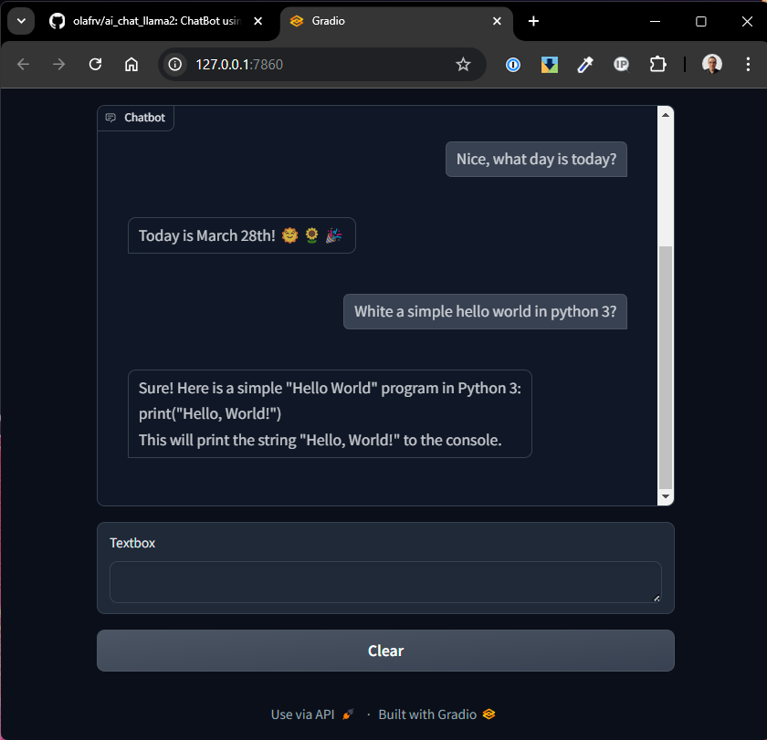

# AI Chat Llama2

ChatBot using Meta AI Llama v2 LLM model on your local PC.

<a href="ai_chat_llama2.png"></a> 

## ChatBot Running

> Only working for GGML model (hardcoded), I need time to test others.

```bash
git clone https://github.com/olafrv/ai_chat_llama.git
cd ai_chat_llama
sudo apt install make
# For llama-cpp-python errors on make, see requirements.txt
make install
# Llama v2 models will be downloaded (~15 GiB)
export AI_LLAMA2_CHAT_STORE=./models 
# export PYTHON_VENV_DIR=~/venv/ai_chat_llama2
AI_LLAMA2_CHAT_MODEL=0 make run   
# Navigate in your browser at 127.0.0.1:7860
```

## Model Training (Draft)

* Register at https://huggingface.co to use AutoTrain Advanced:
https://huggingface.co/docs/autotrain/index

* Now install python environment and setup autotrain:
```bash
make install
autotrain setup
```

* Train the base LLAMA v2 model with custom data set:
```bash
# autotrain llm --help
# autotrain setup --update-torch  # Only if using Google Collab
autotrain llm --train \
--data_path . \
--model meta-llama/Llama-2-7b-hf \
--learning_rate 2e-4 \
--num_train_epochs 3 \
--train_batch_size 12 \ 
--block-size 2048
--use_peft \
--train_on_inputs \
--project_name llama_trained \
--use_int4 \
--trainer sft
```

# NVIDIA

```bash
# Bare metal Linux or WSL2 on Windows
nvidia-smi
sudo apt-get install -y nvidia-docker2
sudo docker run --gpus all nvcr.io/nvidia/k8s/cuda-sample:nbody nbody -gpu -benchmark
# https://developer.nvidia.com/cuda-downloads (Linux > deb(network))
wget https://developer.download.nvidia.com/compute/cuda/repos/wsl-ubuntu/x86_64/cuda-keyring_1.1-1_all.deb
sudo dpkg -i cuda-keyring_1.1-1_all.deb
sudo apt-get update
sudo apt-get -y install cuda
git clone https://github.com/nvidia/cuda-samples
cd cuda-samples/Samples/1_Utilities/deviceQuery
make
./deviceQuery
# Device 0: "NVIDIA GeForce RTX 3070 Ti Laptop GPU" ...
# CUDA Driver Version / Runtime Version          12.2 / 12.2
```

## References

* Meta AI Llama v2 LLM Model:
  * Llama v2 model code examples: 
    * https://github.com/facebookresearch/llama.git
  * Llama v2 pre-trained model download (e-mail with signed link):
    * https://ai.meta.com/resources/models-and-libraries/llama-downloads/
  * Llama v2 pre-trained models on Hugging Face: 
    * For GPUs: https://huggingface.co/meta-llama/Llama-2-7b-chat-hf
    * GPTQ Quantized: https://huggingface.co/TheBloke/Llama-2-7b-Chat-GPTQ
    * GGML Quantized: https://huggingface.co/TheBloke/Llama-2-7B-Chat-GGML
* HuggingFace:
  * https://huggingface.co
  * https://huggingface.co/docs/huggingface_hub/quick-start
  * https://huggingface.co/docs/autotrain/index
* GRadio: https://www.gradio.app/guides/quickstart
* NVIDIA CUDA on Windows Subsystem for Linux v2 (aka WSL2):
  * https://developer.nvidia.com/cuda/wsl
  * https://learn.microsoft.com/en-us/windows/wsl/tutorials/gpu-compute
  * https://docs.nvidia.com/cuda/wsl-user-guide/index.html#getting-started-with-cuda-on-wsl
  * https://developer.nvidia.com/cuda-downloads?target_os=Linux&target_arch=x86_64&Distribution=WSL-Ubuntu&target_version=2.0
  * https://ubuntu.com/tutorials/enabling-gpu-acceleration-on-ubuntu-on-wsl2-with-the-nvidia-cuda-platform
* NVIDIA CUDA for Ubuntu Linux on Baremetal:
  * https://docs.nvidia.com/cuda/cuda-installation-guide-linux/index.html#wsl
* Tricky references in the [main.py](main.py) source code.
